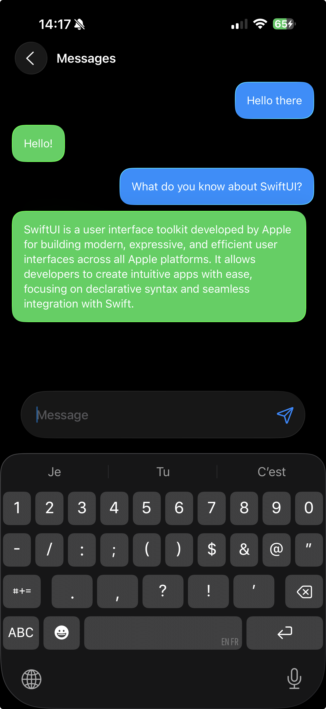

# FoundationChat

A SwiftUI chat application built with Apple's Foundation Models framework, showcasing on-device AI capabilities with persistent conversation storage.



## Requirements

- **iOS 26.0+** / iPadOS 26.0+ / macOS 26.0+ / visionOS 26.0+
- **Xcode 26.0+** (with iOS 26 SDK)
- Device with Apple Intelligence support
- Apple Intelligence must be enabled in Settings

## Features

- ✅ **Multiple Conversations**: Create and manage multiple chat conversations
- ✅ **Persistent Storage**: SwiftData integration for conversation history
- ✅ **Real-time Streaming**: Live streaming responses with structured output
- ✅ **Smart Summaries**: Automatic conversation summarization
- ✅ **Availability Checking**: Proper Foundation Models availability handling
- ✅ **Modern SwiftUI**: Clean interface with navigation stack and swipe actions
- ✅ **On-device AI**: No internet required, complete privacy

## Architecture

### Core Components

- **`ChatEngine`**: Manages Foundation Models sessions and streaming responses
- **`Conversation`** & **`Message`**: SwiftData models for persistent storage
- **`MessageGenerable`**: @Generable struct for structured AI responses
- **`ConversationsListView`**: Main interface for managing conversations
- **`ConversationDetailView`**: Chat interface with streaming message support

### Data Flow

1. **Conversations List**: Shows all conversations sorted by last message timestamp
2. **Chat Interface**: Real-time streaming with SwiftData persistence
3. **Message Streaming**: Uses `@Generable` for structured AI responses
4. **Auto-Summarization**: Updates conversation summaries after each exchange

## Getting Started

1. Open `FoundationChat.xcodeproj` in Xcode
2. Ensure your development device has Apple Intelligence enabled
3. Build and run on a supported device (simulator not recommended for performance)
4. Create a new conversation with the "+" button
5. Start chatting with the on-device AI

## Key Implementation Details

### Foundation Models Integration
```swift
@Observable
class ChatEngine {
    private let model = SystemLanguageModel.default
    private let session: LanguageModelSession
    
    var isAvailable: Bool {
        switch model.availability {
        case .available: return true
        default: return false
        }
    }
}
```

### Structured Streaming Response
```swift
func respondTo() async -> LanguageModelSession.ResponseStream<MessageGenerable>? {
    session.streamResponse(generating: MessageGenerable.self) {
        // Conversation context with full history
    }
}
```

### SwiftData Persistence
```swift
@Model
class Conversation {
    @Relationship(deleteRule: .cascade)
    var messages: [Message]
    var summary: String?
}
```

## Documentation

- **[CLAUDE.md](CLAUDE.md)** - Development guidelines and framework overview
- **[Examples](EXAMPLES/)** - Comprehensive implementation examples:
  - Basic Usage
  - Structured Output
  - Streaming Responses
  - Tool Calling
  - Performance & Safety
  - Complete Chat App

## Project Structure

```
FoundationChat/
├── Models/
│   ├── SwiftData/          # Data persistence models
│   └── Generable/          # Foundation Models structures
├── Views/
│   ├── ConversationsList/   # Main conversation list
│   └── ConversationDetail/  # Chat interface
├── Env/
│   └── ChatEngine.swift    # Foundation Models integration
└── FoundationChatApp.swift # App entry point
```

## Contributing

This is a demonstration project showcasing Apple's Foundation Models framework. Feel free to:
- Fork and experiment with different AI prompts
- Extend with additional Foundation Models features
- Add new UI components and interactions
- Contribute improvements and bug fixes

## License

MIT License - See LICENSE file for details